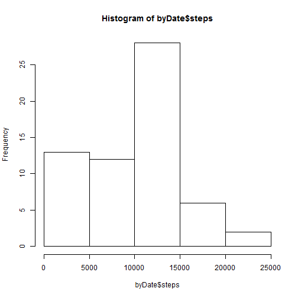

## Loading and preprocessing the data

```r
unzip("activity.zip")
activity <- read.csv("activity.csv")
byDate <- aggregate(activity$steps, by=list(date = activity$date), FUN = sum, na.rm=TRUE, na.action=NULL)
names(byDate)[2] = "steps"
```


## What is mean total number of steps taken per day?

```r
hist(byDate$steps)
```


The mean of steps per day is 9354.2295082.
The median steps per day is 10395.


## What is the average daily activity pattern?


## Imputing missing values


## Are there differences in activity patterns between weekdays and weekends?
