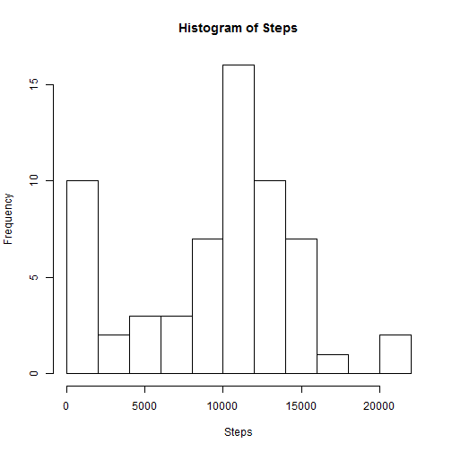
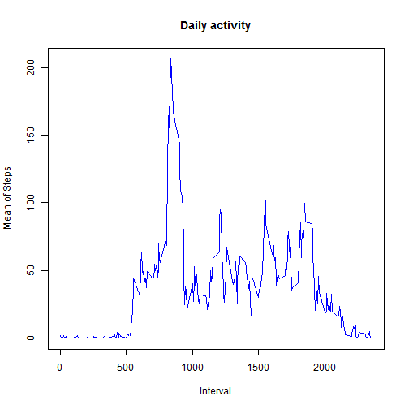
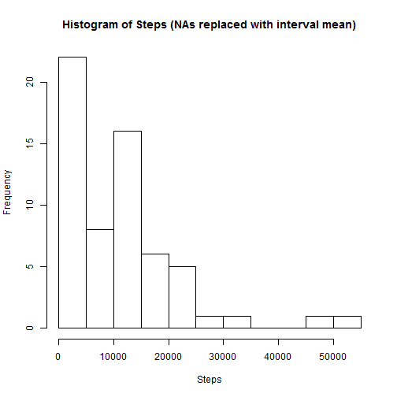
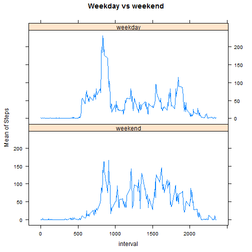

## Loading and preprocessing the data

```r
unzip("activity.zip")
activity <- read.csv("activity.csv")
```


## What is mean total number of steps taken per day?

```r
byDate <- aggregate(activity$steps, by=list(date = activity$date), FUN = sum, na.rm=TRUE, na.action=NULL)
names(byDate)[2] = "steps"
hist(byDate$steps, main="Histogram of Steps", xlab="Steps", breaks=10)
```



The mean of steps per day is 9354.23.

The median steps per day is 10395.


## What is the average daily activity pattern?

```r
byInterval <- aggregate(activity$steps, by=list(interval = activity$interval), FUN = mean, na.rm=TRUE, na.action=NULL)
names(byInterval)[2] = "avgSteps"
plot(byInterval$interval, byInterval$avgSteps, type="l", main="Daily activity", xlab= "Interval", ylab="Mean of Steps", col="blue")
```




## Imputing missing values
There are 2304 rows with NAs in the dataset.

Will use the average for each interval to fill in NAs.


```r
merged <- merge(activity, byInterval, by = "interval")
merged$steps[is.na(merged$steps)] <- merged$avgSteps[is.na(merged$steps)]
byDate <- aggregate(merged$steps, by=list(date = activity$date), FUN = sum)
names(byDate)[2] = "steps"
hist(byDate$steps, main="Histogram of Steps (NAs replaced with interval mean)", xlab="Steps", breaks=10)
```



The mean of steps per day is 10766.19.

The median steps per day is 10351.62.

"Do these values differ from the estimates from the first part of the assignment?"

Yes.
 
"What is the impact of imputing missing data on the estimates of the total daily number of steps?"

Intervals with fewer steps are better represented.
 
## Are there differences in activity patterns between weekdays and weekends?

Convert "date" column to date for use by function weekdays

Classify weekdays


```r
merged$date <- as.Date(merged$date)
weekend <- c('Saturday', 'Sunday')
merged$dayType <- factor((weekdays(merged$date) %in% weekend), levels=c(TRUE, FALSE), labels=c('weekend', 'weekday'))
byInterval <- aggregate(merged$steps, by=list(dayType=merged$dayType, interval = merged$interval), FUN = mean)
names(byInterval)[3] = "avgSteps"
xyplot(avgSteps ~ interval | dayType, data = byInterval, type = "l", main="Weekday vs weekend", ylab="Mean of Steps", layout=c(1,2))
```


